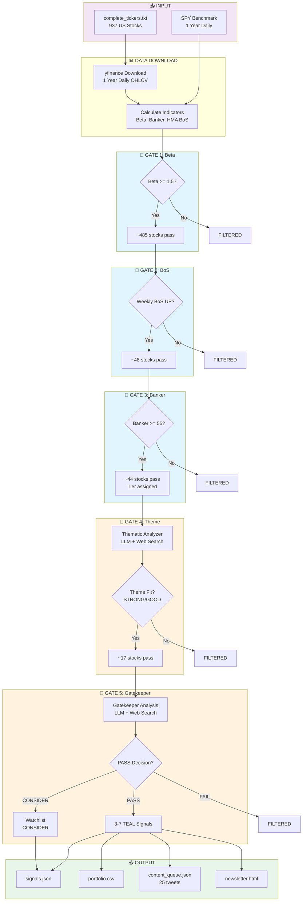

# Sterling Signals Scanner Logic Audit

**Document:** `docs/audit/01-scanner-logic.md`
**Audit Date:** January 28, 2026
**System Version:** BoS Momentum Scanner v2.x

---

## Executive Summary

The Sterling Signals scanner is a **5-gate weekly momentum trading system** that filters a universe of ~937 US stocks down to 3-7 actionable "TEAL signals" through progressive technical and LLM-powered analysis gates. The system runs automatically on Fridays at 4:30 PM ET via GitHub Actions.

**Key Finding:** The system is well-architected with proper safeguards, but has several undocumented behaviors and 10 concerns that warrant attention before production deployment.

---

## Table of Contents

1. [Entry Points & Triggers](#1-entry-points--triggers)
2. [Universe & Pre-Filtering](#2-universe--pre-filtering)
3. [Technical Indicator Calculations](#3-technical-indicator-calculations)
4. [5-Gate Filtering Pipeline](#4-5-gate-filtering-pipeline)
5. [Configuration Parameters](#5-configuration-parameters)
6. [Complete Data Flow Diagram](#6-complete-data-flow-diagram)
7. [Magic Numbers & Thresholds](#7-magic-numbers--thresholds)
8. [Questions & Concerns](#8-questions--concerns)

---

## 1. Entry Points & Triggers

### 1.1 Automated Triggers

| Trigger | File | Schedule | Time (ET) |
|---------|------|----------|-----------|
| **Weekly Scan** | `.github/workflows/friday_scan.yml` | Friday | 4:30 PM |
| **Daily Post Slot 1** | `.github/workflows/daily_post.yml` | Daily | 08:00 |
| **Daily Post Slot 2** | `.github/workflows/daily_post.yml` | Daily | 10:00 |
| **Daily Post Slot 3** | `.github/workflows/daily_post.yml` | Daily | 12:30 |
| **Daily Post Slot 4** | `.github/workflows/daily_post.yml` | Daily | 15:30 |
| **Daily Post Slot 5** | `.github/workflows/daily_post.yml` | Daily | 18:00 |

### 1.2 Manual Triggers

| Method | Command | Description |
|--------|---------|-------------|
| CLI (Full) | `python scanner.py --web-search` | Full pipeline with LLM + web search |
| CLI (Technical) | `python scanner.py --no-llm` | Technical gates only, no LLM cost |
| CLI (Limited) | `python scanner.py --no-llm --top 50` | Quick test with top 50 by beta |
| GitHub UI | Actions → friday_scan → Run workflow | Manual trigger with parameters |

### 1.3 Main Entry Function

**File:** `scanner.py` lines 3095-3362

```python
def main() -> int:
    """Main CLI entry point for scanner."""
    parser = argparse.ArgumentParser()
    parser.add_argument('--no-llm', action='store_true')      # Skip LLM gates
    parser.add_argument('--web-search', action='store_true')  # Enable web search
    parser.add_argument('--top', type=int)                     # Limit to top N by beta
    parser.add_argument('--archive', action='store_true')      # Save to week folder
    parser.add_argument('--no-momentum', action='store_true')  # Skip momentum gate (deprecated)
    # ... more arguments

    return run_scan(**args)
```

**Pipeline Entry:** `run_scan()` function (lines 1146-1400)

---

## 2. Universe & Pre-Filtering

### 2.1 Ticker Universe

**Source File:** `complete_tickers.txt`
**Current Size:** 937 tickers (as of January 2026)
**Load Function:** `load_tickers()` (scanner.py lines 253-276)

```python
def load_tickers() -> List[str]:
    """Load tickers from complete_tickers.txt"""
    # Validates format: 1-6 chars, alphanumeric + dots/dashes
    # Strips comments (#) and empty lines
    # Returns deduplicated, sorted list
```

### 2.2 TradingView Screener Integration

**Status:** NOT IMPLEMENTED

The system does NOT integrate with TradingView's screener for pre-filtering. Instead:
- Universe is static in `complete_tickers.txt`
- All 937 tickers are downloaded and analyzed
- Filtering happens programmatically (not at source)

**Implication:** Download time and API calls scale with full universe, not pre-filtered set.

### 2.3 Data Download Pipeline

**Function:** `download_and_process()` (scanner.py lines 524-607)

**Data Source:** yfinance (Yahoo Finance API)
- Period: 1 year daily OHLCV
- Batch size: 50 tickers per chunk
- Error handling: Failed downloads logged, non-blocking

**Download Flow:**
```
1. Load 937 tickers from file
2. Download SPY benchmark (1 year daily returns)
3. Chunk tickers into batches of 50
4. For each batch:
   - Download via yfinance.download()
   - Calculate indicators per stock
   - Store in Stock dataclass
5. Return dict of {symbol: Stock}
```

---

## 3. Technical Indicator Calculations

### 3.1 Beta Calculation

**Function:** `calculate_beta()` (scanner.py lines 283-297)

**Formula:**
```
Beta = Covariance(stock_returns, SPY_returns) / Variance(SPY_returns)
```

**Parameters:**
- Benchmark: SPY (S&P 500 ETF)
- Period: 1 year daily returns
- Minimum data: 60 trading days
- Output: Float rounded to 2 decimals

**Threshold:** Beta >= 1.5 (config.py line 75)

**Rationale:** High-beta stocks amplify market moves, better for momentum strategies.

### 3.2 Hull Moving Average (HMA)

**Function:** `calculate_hma()` (scanner.py lines 333-353)

**Formula:**
```
HMA(n) = WMA(2 * WMA(n/2) - WMA(n), sqrt(n))

Where:
- WMA = Weighted Moving Average
- n = period (default: 21)
- Input: HL2 = (High + Low) / 2
```

**Parameters:**
- Default period: 21 (weekly timeframe)
- Uses weighted moving average helper function

**Purpose:** Smoother than SMA/EMA, less lag, better for identifying pivots.

### 3.3 HMA Pivot Break of Structure (BoS)

**Function:** `calculate_bos()` (scanner.py lines 385-490)

**Step-by-Step Process:**

1. **Resample to Weekly:**
   ```python
   weekly = daily.resample('W-FRI').agg({...})
   ```

2. **Calculate HMA on HL2:**
   ```python
   hma = calculate_hma(weekly['HL2'], length=21)
   ```

3. **Find Pivots (k=1 lookback):**
   ```python
   pivot_high[i] = hma[i] > max(hma[i-1], hma[i+1])
   pivot_low[i] = hma[i] < min(hma[i-1], hma[i+1])
   ```

4. **Build Step Lines:**
   - Upper step line = most recent pivot high value
   - Lower step line = most recent pivot low value

5. **Detect Signal:**
   ```python
   bos_up = (lower_step_line changed)   # BUY signal
   bos_down = (upper_step_line changed) # SELL signal
   ```

**Output:**
- `stock.bos_bullish` (True/False)
- `stock.bos_bearish` (True/False)
- `stock.bos_debug` (dict with weekly bars, HMA values, step lines)

**Key Parameter:** `pivot_k = 1` - This means pivots are confirmed 1 bar AFTER they form (1 week lag).

### 3.4 Banker Indicator (Institutional Accumulation)

**Function:** `calculate_banker()` (scanner.py lines 300-330)

**Formula:**
```
vwap_20d = (typical_price * volume).rolling(20).sum() / volume.rolling(20).sum()
deviation_pct = (close / vwap_20d - 1) * 100
banker = 50 + (deviation_pct * 5)

Where:
- typical_price = (High + Low + Close) / 3
- vwap_20d = 20-day Volume Weighted Average Price
```

**Interpretation:**
| Banker Value | VWAP Deviation | Tier | Meaning |
|--------------|----------------|------|---------|
| 50 | At VWAP | - | Neutral |
| 55 | +1% | TIER3 | Slight accumulation (entry minimum) |
| 60 | +2% | TIER2 | Moderate accumulation |
| 70 | +4% | TIER1 | Strong accumulation |

**Threshold:** Banker >= 55 (config.py line 78)

### 3.5 4-Week Momentum (DEPRECATED)

**Location:** scanner.py lines 578-589

**Formula:**
```python
momentum_4w = (close_now / close_4_weeks_ago - 1) * 100
```

**Status:** DEPRECATED - Backtest showed -3.1% return reduction when used as filter.
- Still calculated and stored
- No longer used for gating decisions
- `passes_momentum_filter()` always returns True

---

## 4. 5-Gate Filtering Pipeline

### 4.1 Gate Overview

```
GATE 1: Beta >= 1.5                    [Technical - scanner.py]
   ↓
GATE 2: Weekly BoS UP                  [Technical - scanner.py]
   ↓
GATE 3: Banker >= 55                   [Technical - scanner.py]
   ↓
GATE 4: Theme Fit (STRONG/GOOD)        [LLM - thematic_analyzer.py]
   ↓
GATE 5: Gatekeeper PASS                [LLM - gatekeeper.py]
   ↓
OUTPUT: TEAL Signal (3-7 per week)
```

### 4.2 Gate 1-3: Technical Gate

**Function:** Part of `download_and_process()` and filtering logic

**Combined Criteria:**
```python
technical_pass = (
    stock.beta >= 1.5 and
    stock.bos_bullish == True and
    stock.banker >= 55
)
```

**Tier Assignment (Based on Banker):**
```python
if banker > 70:
    tier = "TIER1"      # Strong signal
elif banker > 60:
    tier = "TIER2"      # Moderate signal
elif banker > 55:
    tier = "TIER3"      # Entry minimum
```

**Typical Results:** ~937 tickers → ~20-50 pass technical gates

### 4.3 Gate 4: Thematic Analyzer

**File:** `thematic_analyzer.py`

**Integration:** `run_thematic_gate()` (scanner.py lines 614-756)

**Two-Step Process:**

**Step 1: Identify Themes**
- LLM analyzes market conditions
- Identifies top 5 investment themes
- Classifies each: PRIME, INVESTABLE, SELECTIVE, AVOID
- Uses web search if enabled (5-10 searches)

**Step 2: Map Stocks to Themes**
- Each technical candidate mapped to best-fit theme
- Scored on theme alignment (0-10)
- Verdict assigned: STRONG FIT, GOOD FIT, MODERATE FIT, POOR FIT

**Filtering:** Only STRONG FIT or GOOD FIT pass to Gate 5

**Fields Added to Stock:**
- `stock.theme` - Theme name
- `stock.theme_score` - 0-10 composite score
- `stock.pure_play_score` - 0-100% purity
- `stock.theme_verdict` - Fit classification

**Typical Results:** ~20-50 → ~10-20 pass theme gate

### 4.4 Gate 5: Gatekeeper

**File:** `gatekeeper.py`

**Integration:** `run_gatekeeper()` (scanner.py lines 763-896)

**Analysis Per Stock:**
1. **Catalyst Check:** Earnings, events within 90 days
2. **Red Flag Scan:** Auditor issues, insider selling, SEC investigations
3. **Sentiment Analysis:** Analyst trends, short interest
4. **Conviction Score:** 1-5 star assessment

**Decision Matrix:**

| Condition | Decision | Output |
|-----------|----------|--------|
| Clear catalyst + clean governance | PASS | `final_decision = "PASS"` |
| Good setup but timing concern | CAUTION | `final_decision = "CONSIDER"` |
| Immediate disqualifier | FAIL | Filtered out |

**Immediate Disqualifiers (→ FAIL):**
- Auditor resignation or delayed 10-K
- CFO/CEO departure within 60 days
- Shelf offering (S-3) filed in last 30 days
- Active SEC/DOJ investigation
- Earnings in < 5 trading days

**Caution Triggers (→ CONSIDER):**
- Earnings in 5-15 trading days
- Short interest > 25%
- Single analyst downgrade
- Insider selling under 10b5-1 plan

**Fields Added to Stock:**
- `stock.final_decision` - PASS, CONSIDER, FAIL
- `stock.conviction` - 1-5 score
- `stock.catalyst_summary` - Text description
- `stock.red_flag_level` - CLEAN, MINOR, SEVERE
- `stock.bullish_factors` - Top 3 positives
- `stock.risk_factors` - Top 3 risks
- `stock.action` - Recommended action

**Typical Results:** ~10-20 → 3-7 PASS (TEAL signals)

---

## 5. Configuration Parameters

### 5.1 Main Configuration File

**File:** `config.py`

### 5.2 Trading Thresholds

```python
# Entry Criteria (Lines 71-78)
BETA_THRESHOLD = 1.5          # Minimum beta for entry
BANKER_TIER1 = 70.0           # Strong accumulation (4%+ above VWAP)
BANKER_TIER2 = 60.0           # Moderate accumulation (2%+ above VWAP)
BANKER_TIER3 = 55.0           # Entry minimum (1%+ above VWAP)

# Exit Criteria (Lines 71-73)
TRAILING_STOP_PCT = 20.0      # Primary exit: 20% from highest close
STOP_WARNING_PCT = 5.0        # Alert when within 5% of stop
TIGHTEN_STOP_PCT = 15.0       # Tighten to 15% on BoS down
```

### 5.3 Theme Scoring Thresholds

```python
# Theme Classification (Lines 201-204)
THEME_SCORE_PRIME = 7.5       # Highest conviction themes
THEME_SCORE_INVESTABLE = 6.0  # Good opportunities
THEME_SCORE_SELECTIVE = 4.5   # Mixed signals
# Below 4.5 = AVOID
```

### 5.4 LLM Settings

```python
# Model Selection (Lines 89-96)
MODEL_SONNET = "claude-sonnet-4-20250514"
MODEL_OPUS = "claude-opus-4-5-20251101"
MODEL_THEMATIC = MODEL_SONNET     # Cost-efficient
MODEL_GATEKEEPER = MODEL_SONNET

# Rate Limiting (Lines 102-107)
MAX_RETRIES = 5
RATE_LIMIT_COOLDOWN = 60.0        # Seconds on rate limit
INTER_STEP_DELAY = 30.0           # Between analyzer/gatekeeper
INTER_STOCK_DELAY = 8.0           # Between per-stock calls
```

### 5.5 Content Generation

```python
# Tweet Schedule (Lines 90-96)
SLOTS = {
    1: "pre_market",     # 08:00 ET
    2: "morning",        # 10:00 ET
    3: "midday",         # 12:30 ET
    4: "power_hour",     # 15:30 ET - CRITICAL
    5: "after_hours"     # 18:00 ET
}

TWEETS_PER_DAY = 5
TWEETS_PER_WEEK = 25
```

---

## 6. Complete Data Flow Diagram



### Text Representation (if Mermaid not rendered)

```
INPUT (937 tickers)
    │
    ▼
[DOWNLOAD] yfinance 1Y daily + SPY benchmark
    │
    ▼
[CALCULATE] Beta, Banker, HMA Pivot BoS, 4w Momentum
    │
    ▼
╔═══════════════════════════════════════════════╗
║  GATE 1: Beta >= 1.5                          ║
║  ~485 of 937 pass (~52%)                      ║
╚═══════════════════════════════════════════════╝
    │
    ▼
╔═══════════════════════════════════════════════╗
║  GATE 2: Weekly BoS UP (bullish pivot)        ║
║  ~48 of 485 pass (~10%)                       ║
╚═══════════════════════════════════════════════╝
    │
    ▼
╔═══════════════════════════════════════════════╗
║  GATE 3: Banker >= 55                         ║
║  ~44 of 48 pass (~92%)                        ║
║  Tier assigned: TIER1/TIER2/TIER3             ║
╚═══════════════════════════════════════════════╝
    │
    ▼
╔═══════════════════════════════════════════════╗
║  GATE 4: Thematic Analyzer (LLM)              ║
║  Theme mapping + fit scoring                  ║
║  ~17 of 44 pass (~39%) - STRONG/GOOD FIT      ║
╚═══════════════════════════════════════════════╝
    │
    ▼
╔═══════════════════════════════════════════════╗
║  GATE 5: Gatekeeper (LLM)                     ║
║  Catalyst + Red flag + Sentiment analysis     ║
║  3-7 PASS signals (~35%)                      ║
║  5-10 CONSIDER signals (watchlist)            ║
╚═══════════════════════════════════════════════╝
    │
    ▼
OUTPUT
├── signals.json (full results)
├── portfolio.csv (new trades added)
├── content_queue.json (25 tweets)
└── newsletter.html (compiled newsletter)
```

---

## 7. Magic Numbers & Thresholds

### 7.1 All Configurable Parameters

| Parameter | Value | Location | Impact | Configurable? |
|-----------|-------|----------|--------|---------------|
| Beta threshold | 1.5 | config.py:75 | Pre-filter volatility | ✅ Yes |
| Banker TIER1 | 70 | config.py:76 | Top conviction tier | ✅ Yes |
| Banker TIER2 | 60 | config.py:77 | Mid confidence tier | ✅ Yes |
| Banker entry min | 55 | config.py:78 | Minimum entry bar | ✅ Yes |
| Trailing stop | 20% | config.py:71 | Exit trigger | ✅ Yes |
| Tighten stop | 15% | config.py:73 | BoS down response | ✅ Yes |
| Theme PRIME | 7.5 | config.py:201 | Highest conviction | ✅ Yes |
| Theme INVESTABLE | 6.0 | config.py:202 | Good theme | ✅ Yes |
| Theme SELECTIVE | 4.5 | config.py:203 | Mixed signals | ✅ Yes |

### 7.2 Hardcoded Parameters (Should Be Configurable)

| Parameter | Value | Location | Concern |
|-----------|-------|----------|---------|
| HMA period | 21 | scanner.py:430 | Hardcoded in function |
| Pivot window (k) | 1 | scanner.py:401 | Hardcoded, affects signal lag |
| Banker VWAP period | 20 | scanner.py:320 | Hardcoded in function |
| Banker multiplier | 5 | scanner.py:328 | Undocumented scaling factor |
| yfinance batch size | 50 | scanner.py:558 | Performance vs rate limit |
| Data period | "1y" | scanner.py:553 | Hardcoded string |
| Min data points | 60 | scanner.py:289 | Beta calculation requirement |

### 7.3 LLM Cost Parameters

| Parameter | Value | Cost Impact |
|-----------|-------|-------------|
| Web search per call | $0.01 | Adds up quickly |
| Gatekeeper searches/stock | 2-3 | ~$0.03/stock |
| Thematic searches | 5-10 | ~$0.10/run |
| **Total with web search** | - | **$1-3/run** |
| **Total without web search** | - | **$0.30-0.50/run** |

---

## 8. Questions & Concerns

### CRITICAL CONCERNS

#### CONCERN 1: Web Search Cost Control 🔴 HIGH
**Location:** config.py, gatekeeper.py, thematic_analyzer.py

**Problem:** No spending limit enforced when `--web-search` enabled.
- Each search costs $0.01
- 20 stocks × 3 searches = $0.60 just for gatekeeper
- Running `--web-search --top 100` could cost $10+ unexpectedly

**Recommendation:** Add `MAX_WEB_SEARCH_COST` parameter with warning when approached.

---

#### CONCERN 2: Ticker Universe Discrepancy 🔴 HIGH
**Location:** CLAUDE.md vs complete_tickers.txt

**Problem:** Documentation claims ~1800 stocks, actual file has 937 tickers.
- 50% smaller universe than documented
- May be missing major sectors or exchanges
- Could mean fewer signals than users expect

**Recommendation:** Either expand universe or update documentation.

---

### MEDIUM CONCERNS

#### CONCERN 3: BoS Pivot Detection Lag 🟠 MEDIUM
**Location:** scanner.py lines 385-490

**Problem:** Using `pivot_k = 1` means pivots are confirmed 1 bar AFTER they form.
- For weekly BoS: Signal detected **1 week after pivot forms**
- Stocks may have already moved 5-15% before signal triggers
- Not documented in entry instructions

**Recommendation:** Document this lag in CLAUDE.md and consider alternative detection methods.

---

#### CONCERN 4: Banker Formula Scaling 🟠 MEDIUM
**Location:** scanner.py lines 325-328

**Problem:** The `* 5` multiplier in banker formula is undocumented.
- Creates non-linear relationship between VWAP deviation and score
- Makes thresholds less intuitive (55 = 1% above VWAP)
- No theoretical basis documented

**Recommendation:** Add clear documentation explaining the scaling rationale.

---

#### CONCERN 5: Gatekeeper Missing Theme Freshness Check 🟠 MEDIUM
**Location:** gatekeeper.py lines 132-193

**Problem:** Gate 5 doesn't re-verify theme alignment.
- Theme could have deteriorated between Gate 4 and Gate 5
- Institutional flows could have reversed
- No "is this theme still hot?" check

**Recommendation:** Add theme freshness validation to gatekeeper prompt.

---

### LOW CONCERNS

#### CONCERN 6: Momentum Filter Deprecated but Still Calculated 🟡 LOW
**Location:** scanner.py lines 127-131, 189-195, 578-589

**Problem:** 4-week momentum is calculated but never used.
- Backtest showed -3.1% return reduction when used as filter
- `passes_momentum_filter()` always returns True
- Code is dead weight, may confuse developers

**Recommendation:** Either remove entirely or add clear deprecation notice.

---

#### CONCERN 7: Gatekeeper Binary Decisions 🟡 LOW
**Location:** gatekeeper.py lines 46-49

**Problem:** No middle-ground decision.
- Must choose PASS or FAIL (CAUTION treated as FAIL for trading)
- "Good setup but timing risky" still requires human override
- No "REDUCED POSITION SIZE" option

**Recommendation:** Consider adding position size guidance to gatekeeper output.

---

#### CONCERN 8: SPY as Only Beta Benchmark 🟡 LOW
**Location:** scanner.py lines 283-297

**Problem:** Beta calculated only against SPY.
- Tech stocks might have different beta vs QQQ
- No sector-specific benchmark option
- Design choice but undocumented rationale

**Recommendation:** Document why SPY was chosen over alternatives.

---

#### CONCERN 9: Holiday Week Date Handling 🟡 LOW
**Location:** scanner.py line 415

**Problem:** Weekly BoS uses `resample('W-FRI')`.
- If Friday is a holiday, uses Thursday close
- BoS signals could be 1-2 days delayed on holiday weeks
- Not documented anywhere

**Recommendation:** Add holiday handling logic or document behavior.

---

#### CONCERN 10: Rate Limiting May Cause Timeouts 🟡 LOW
**Location:** config.py lines 102-107, scanner.py lines 827-828

**Problem:** Fixed 8-second delays between stock calls.
- 20 stocks = 160 seconds minimum for gatekeeper
- GitHub Actions timeout is 90 minutes
- No exponential backoff for sustained rate limits

**Recommendation:** Add exponential backoff and timeout handling.

---

## Appendix A: Exit Logic

### A.1 Sell Signal Detection

**Function:** `check_sell_signals()` (scanner.py lines 913-1072)

**Priority 1: PRIMARY EXIT**
```
Condition: Weekly BoS Down signal detected
Action: Flag position for exit
```

**Priority 2: BACKUP EXIT**
```
Condition: Price dropped >= 20% from highest_close
Action: Trailing stop triggered
```

**Priority 3: CAUTION**
```
Condition: BoS Down on open position
Action: Tighten stop to 15%
```

### A.2 Portfolio Tracking

**File:** `trades/portfolio.csv`

**Status Values:**
- `OPEN` - Active position
- `CLOSED` - Manual exit (profit-taking)
- `STOPPED` - Hit trailing stop

---

## Appendix B: Output Files

| File | Description | Updated By |
|------|-------------|------------|
| `trades/signals.json` | Full scan results | scanner.py |
| `trades/portfolio.csv` | Trade tracking | portfolio_manager.py |
| `trades/content_queue.json` | Weekly tweets (25) | tweet_generator.py |
| `trades/current/newsletter.html` | Compiled newsletter | newsletter_compiler.py |
| `trades/latest_report.txt` | Human-readable summary | scanner.py |
| `trades/analysis_log.csv` | Historical scan data | scanner.py |

---

## Document Control

| Version | Date | Author | Changes |
|---------|------|--------|---------|
| 1.0 | 2026-01-28 | Claude Code Audit | Initial comprehensive audit |

---

*End of Document*
