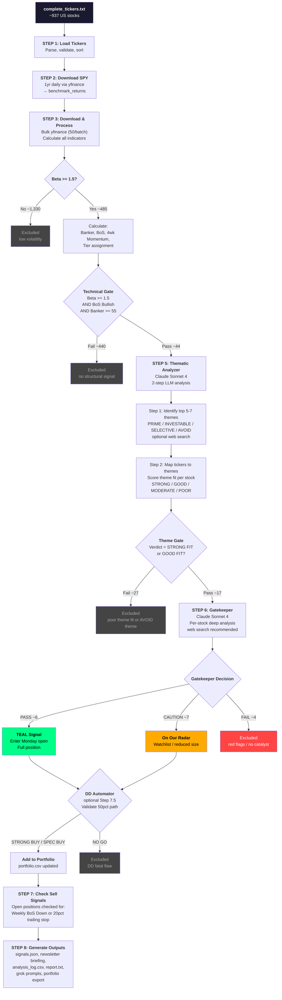

# Scanner Logic Audit — Sterling Signals

**Audit Date:** 2026-01-29
**Codebase:** BoS Momentum Scanner (`bos_momentum_scanner/`)
**Primary File:** `scanner.py` (~3,100 lines)
**Supporting Modules:** `thematic_analyzer.py`, `gatekeeper.py`, `dd_automator.py`, `portfolio_manager.py`, `config.py`

---

## Table of Contents

1. [Entry Points & Triggers](#1-entry-points--triggers)
2. [Complete Data Flow Diagram](#2-complete-data-flow-diagram)
3. [Pipeline Stages in Detail](#3-pipeline-stages-in-detail)
4. [Custom Indicator Documentation](#4-custom-indicator-documentation)
5. [LLM Gate Documentation](#5-llm-gate-documentation)
6. [Configuration Reference](#6-configuration-reference)
7. [Output Files & Schemas](#7-output-files--schemas)
8. [Questions & Concerns](#8-questions--concerns)

---

## 1. Entry Points & Triggers

### 1.1 Manual Execution

```bash
# Full production scan (~$1-3)
python scanner.py --web-search

# Technical only ($0)
python scanner.py --no-llm

# Limited universe
python scanner.py --web-search --top 50
```

**CLI Arguments** (`scanner.py` main, ~line 3096):

| Argument | Type | Default | Purpose |
|----------|------|---------|---------|
| `--no-llm` | flag | false | Skip ALL LLM gates (thematic + gatekeeper) |
| `--no-momentum` | flag | false | Skip gatekeeper only (keep themes) |
| `--assess-top N` | int | None | Only run gatekeeper on top N by Banker |
| `--top N` | int | None | Limit universe to top N by beta |
| `--web-search` | flag | false | Enable web search in LLM calls |
| `--archive` | flag | false | Save dated archive files |
| `--verbose` / `-v` | flag | false | Expanded diagnostic output |
| `--no-dd` | flag | false | Skip automated due diligence |
| `--full-dd` | flag | false | Use Opus model for DD (deeper, costlier) |
| `--dd-top N` | int | None | Only run DD on top N by conviction |
| `--save-dd` | flag | false | Save DD reports to `reports/` |
| `--no-email` | flag | false | Skip email notification |
| `--no-prompts` | flag | false | Skip printing DD/newsletter prompts |
| `--no-grok-prompts` | flag | false | Skip generating Grok/X prompts |

### 1.2 Scheduled Execution (GitHub Actions)

**Friday Scanner** (`.github/workflows/friday_scan.yml`):
- **Trigger:** Cron `30 21 * * 5` (Friday 4:30 PM ET / 21:30 UTC)
- **Also:** Manual `workflow_dispatch` with toggles for skip_llm, web_search, top_n, skip_charts, skip_tweets, skip_newsletter
- **Command:** `python scanner.py --archive [flags based on inputs]`

**Daily Tweet Poster** (`.github/workflows/daily_post.yml`):
- **Trigger:** 5 cron jobs daily (13:00, 15:00, 17:30, 20:30, 23:00 UTC)
- **Also:** Manual `workflow_dispatch` with slot selection and dry_run
- **Command:** `python twitter_poster.py --slot $SLOT --account main|account2|account3`

### 1.3 Local Friday Script

```bash
./run_local_friday.sh  # Full pipeline including chart capture
```

Runs scanner, then local-only steps (TradingView chart capture via Playwright, which requires interactive login).

---

## 2. Complete Data Flow Diagram

### 2.1 Mermaid Flowchart — Full Pipeline



### 2.2 Typical Funnel Numbers

```
937 tickers loaded (complete_tickers.txt)
 |-- ~934 data downloaded (99.7% success rate)
      |-- ~485 with Beta >= 1.5 (high volatility filter)
           |-- ~48 with Weekly BoS UP (bullish structural break)
                |-- ~44 with Banker >= 55 (VWAP accumulation) <-- TECHNICAL GATE
                     |-- ~17 theme-confirmed (STRONG/GOOD FIT in PRIME/INVESTABLE)
                          |-- ~6 PASS (TEAL signal -- ready to trade)
                          |-- ~7 CONSIDER (On Our Radar -- watchlist)
                          |-- ~4 FAIL (red flags or no catalyst)
```

**Conversion:** 937 -> 6 TEAL signals = **0.64% pass rate** through all gates.

---

## 3. Pipeline Stages in Detail

### Stage 1: Load Tickers

**Function:** `load_tickers()` (~line 253)
**Input:** `complete_tickers.txt` -- one ticker per line, ~937 entries
**Validation:**
- Skips comment lines (`#`)
- Splits on whitespace, commas, tabs
- Validates: 1-6 chars, contains alpha, alphanumeric/dash/dot only
- Returns sorted, deduplicated list

**No Pre-Filtering:** The ticker file IS the universe. There is no TradingView screener integration or market-cap/volume/price floor pre-filtering at this stage. The file was presumably curated externally (likely from Finviz or TradingView screener export), but the scanner itself does not filter by market cap, volume, or price.

### Stage 2: Download SPY Benchmark

**Function:** Inline in `run_scan()` (~line 1180)
**Source:** `yfinance.download("SPY", period="1y", interval="1d")`
**Output:** Daily returns Series for beta calculation
**Error handling:** Exits if SPY download fails (critical dependency)

### Stage 3: Download Stock Data & Calculate Indicators

**Function:** `download_and_process()` (~line 524)
**Batch size:** 50 tickers per yfinance request
**Period:** 1 year daily OHLCV

**Per-stock processing flow:**

| Step | Calculation | Condition | Output Field |
|------|-------------|-----------|-------------|
| 1 | Current close price | Always | `stock.price` |
| 2 | 20-day return | `len(df) >= 20` | `stock.return_20d` |
| 3 | Beta vs SPY | `len(aligned) >= 60` | `stock.beta` |
| 4 | Banker score | Beta >= 1.5 | `stock.banker` |
| 5 | Break of Structure | Beta >= 1.5, `len(df) >= 60` | `stock.bos_bullish`, `stock.bos_bearish` |
| 6 | Tier assignment | Passes technical criteria | `stock.tier` |
| 7 | 4-week momentum | Beta >= 1.5, `len(weekly) >= 5` | `stock.momentum_4w` |

**Key optimization:** Banker, BoS, and momentum are ONLY calculated for stocks with Beta >= 1.5. Stocks below beta threshold get default values (0.0 / False).

### Stage 4: Technical Gate

**Location:** ~line 1340
**Criteria:** ALL three must be true:

```
Beta >= 1.5        (volatility threshold)
AND bos_bullish    (weekly structural break to upside)
AND Banker >= 55   (price above 20d VWAP by >= 1%)
```

**Implementation:** `stock.meets_technical_criteria()` checks `beta >= 1.5 AND bos_bullish`. Banker >= 55 is implicitly enforced by tier assignment (empty tier = excluded).

**Tier assignment at this stage:**

| Banker Score | Tier | VWAP Deviation |
|:---:|:---:|:---:|
| > 70 | TIER1 | ~4%+ above VWAP |
| 60-70 | TIER2 | ~2-4% above VWAP |
| 55-60 | TIER3 | ~1-2% above VWAP |
| <= 55 | (excluded) | At or below VWAP |

**Momentum filter:** Was backtested and REMOVED. The `momentum_4w` field is still calculated and displayed but `passes_momentum_filter()` always returns `True`. Backtest showed filtering by momentum (<10%) reduced returns from +9.2% to +6.1%.

### Stage 5: Thematic Analyzer (LLM)

**Module:** `thematic_analyzer.py` (~2,100 lines)
**Model:** Claude Sonnet 4 (`claude-sonnet-4-20250514`)
**Max tokens:** 12,000
**Cost:** ~$0.15-0.50 depending on web search

**Two-step process:**

**Step 1 -- Theme Discovery** (`run_step_1()`, ~line 1443):
- System prompt instructs Claude to identify top 5-7 investable themes
- Four evaluation criteria with weighted scoring:

| Criterion | Weight | What It Measures |
|-----------|:---:|---|
| Catalyst Strength | 40% | Active events/trends driving theme NOW |
| Momentum Direction | 25% | Price/flow acceleration |
| Crowding Level | 20% | Inversely scored -- lower crowding = higher score |
| Runway Remaining | 15% | Growth penetration remaining |

- **Composite formula:** `score = catalyst * 0.40 + momentum * 0.25 + crowding * 0.20 + runway * 0.15`

- **Classification thresholds:**

| Score | Classification | Action |
|:---:|:---:|---|
| >= 7.5 | PRIME | Highest conviction |
| 6.0-7.4 | INVESTABLE | Standard |
| 4.5-5.9 | SELECTIVE | Caution |
| < 4.5 | AVOID | Do not invest |

- **Theme types:** TREND (first-order), BOTTLENECK (second-order, preferred), CONTRARIAN (underperformed but improving)

- **Auto-reject if:** Fading momentum (ETF down >10%), extreme crowding, catalyst exhaustion, or structural headwinds

- **Web searches (if enabled):** 4 search groups -- what's working, bottlenecks/supply constraints, contrarian hunts, emerging themes

**Step 2 -- Ticker Mapping** (`run_step_2()`, ~line 1709):
- Maps each technical-gate-passing ticker to a theme
- Evaluates two factors:
  - **Theme Fit** (% of revenue tied to theme): PURE PLAY (>70%), STRONG (50-70%), MODERATE (30-50%), WEAK (<30%)
  - **Company Position**: LEADER, CHALLENGER, NICHE, LAGGARD

- **Verdict rules:**

| Theme Class | Theme Fit | Position | Verdict |
|---|:---:|---|---|
| PRIME | 7+ | Leader/Challenger | **STRONG FIT** |
| PRIME | 5-6 | Any | GOOD FIT |
| INVESTABLE | 7+ | Leader/Challenger | **STRONG FIT** |
| INVESTABLE | 5-6 | Any | GOOD FIT |
| SELECTIVE | 7+ | Leader only | GOOD FIT |
| Any other | -- | -- | MODERATE/WEAK FIT |

- **Gate pass:** `theme_verdict in ["STRONG FIT", "GOOD FIT"]`

### Stage 6: Gatekeeper (LLM)

**Module:** `gatekeeper.py` (~627 lines)
**Model:** Claude Sonnet 4
**Max tokens:** 3,000 per stock
**Cost:** ~$0.03-0.25 per stock (depending on web search)
**Rate limiting:** 8-second delay between stocks; 30-second delay before starting gatekeeper step

**Role prompt:** "Senior Risk Manager at a Long/Short Equity Hedge Fund"

**Core question:** Is this stock capable of **50-100%+ returns in 3-8 months?**

**Per-stock analysis:**
1. Catalyst assessment (events within 90 days)
2. Red flag detection (governance, dilution, legal)
3. Analyst sentiment and short interest
4. Web search (2-3 queries if enabled)

**Immediate disqualifiers -- automatic FAIL:**
- Auditor resignation or delayed 10-K
- CFO/CEO resigned in last 60 days (without succession plan)
- Shelf offering (S-3) filed in last 30 days
- Active SEC or DOJ investigation
- **Earnings in < 5 trading days** (binary risk too high)

**Caution flags -- CAUTION (not FAIL):**
- Earnings in 5-15 trading days
- Short interest > 25%
- Single analyst downgrade
- Insider selling under 10b5-1 plan

**Web searches (3 queries if enabled):**
1. `"{ticker} earnings date analyst consensus short interest {year}"`
2. `"{ticker} SEC filing insider buying selling CFO recent news"`
3. (Conditional) `"{ticker} dilution shelf offering S-3"` -- only if dilution risk detected

**Output per stock:**

| Field | Type | Purpose |
|-------|------|---------|
| `decision` | PASS / CAUTION / FAIL | Trading decision |
| `conviction` | 1-5 | Confidence level |
| `catalyst_present` | bool | Near-term catalyst exists |
| `catalyst_summary` | str | Description of catalyst |
| `days_to_catalyst` | int | Days until event (-1 if none) |
| `red_flag_level` | CLEAN / MINOR / SEVERE | Governance risk |
| `red_flags` | List[str] | Specific flags found |
| `analyst_trend` | BULLISH / NEUTRAL / BEARISH | Street sentiment |
| `short_interest_pct` | float | % of float shorted |
| `key_bullish` | List[str] | Top 3 bull factors |
| `key_risks` | List[str] | Top 3 risk factors |
| `reasoning` | str | 2-3 sentence rationale |
| `action` | str | Specific recommendation |

**Decision mapping to scanner:**
- Gatekeeper PASS -> `stock.final_decision = "PASS"` (TEAL signal)
- Gatekeeper CAUTION -> `stock.final_decision = "CONSIDER"` (watchlist)
- Gatekeeper FAIL -> `stock.final_decision = "FAIL"` (skip)

### Stage 7 (Optional): Automated Due Diligence

**Module:** `dd_automator.py` (~806 lines)
**Triggered:** After gatekeeper, if not `--no-dd` and confirmed stocks exist

**Two modes:**

| Mode | Model | Max Tokens | Thinking | Cost |
|------|-------|:---:|:---:|:---:|
| Quick | Sonnet 4 | 4,000 | -- | ~$0.05-0.15/stock |
| Full (`--full-dd`) | Opus 4 | 8,000 | 10,000 budget | ~$0.30-0.80/stock |

**5-phase Deal Memo methodology:**
1. **Explosive Growth** -- Revenue trajectory, operating leverage, NRR, backlog
2. **Hidden Catalyst** -- Patent approvals, management equity grants, conferences
3. **Bear Killer** -- Dismantle the #1 short thesis
4. **Valuation Reality** -- Current vs historical multiples, path to 50%
5. **Synthesis** -- Verdict, conviction, position sizing

**DD Output:**

| Field | Values |
|-------|--------|
| `dd_verdict` | STRONG BUY, SPEC BUY, NO GO |
| `dd_conviction` | 1-10 |
| `dd_position_size` | FULL, REDUCED (50%), PASS |
| `dd_key_catalyst` | Specific event |
| `dd_fatal_flaw` | "None found" or specific issue |

**Portfolio gate:** Only `STRONG BUY` and `SPEC BUY` verdicts are added to `portfolio.csv`.

### Stage 8: Sell Signal Check

**Function:** `check_sell_signals()` (~line 913)
**Input:** Open positions from `portfolio.csv`

**Two exit criteria:**
1. **Primary -- Weekly BoS Down:** If `stock.bos_bearish == True` -> Caution signal (tighten stop from 20% to 15%)
2. **Backup -- 20% Trailing Stop:** If `((highest_close - current_price) / highest_close) * 100 >= 20%` -> STOPPED

**Portfolio updates:**
- `highest_close` updated if current price exceeds previous high
- `stop_level = highest_close * 0.80`
- `stop_alert = True` if within 5% of stop level

### Stage 9: Output Generation

See [Section 7](#7-output-files--schemas).

---

## 4. Custom Indicator Documentation

### 4.1 Hull Moving Average (HMA)

**Location:** `scanner.py` ~line 333
**Formula:**

```
HMA(n) = WMA( 2 * WMA(n/2) - WMA(n), sqrt(n) )

where WMA = Weighted Moving Average with linear weights [1, 2, 3, ..., n]
```

**Parameters:**

| Parameter | Value | Source | Configurable? |
|-----------|:---:|---|:---:|
| Period (n) | 21 | `hma_length=21` in `calculate_bos()` | Hardcoded default |
| Half period | 10 | `21 // 2` | Derived |
| Sqrt period | 4 | `int(sqrt(21))` | Derived |
| Input series | HL2 | `(High + Low) / 2` of weekly bars | Hardcoded |

**Purpose:** Provides a fast-responding, low-lag moving average. The 21-period weekly HMA tracks structural trend direction with approximately 4-6 weeks of smoothing.

**Why 21?** This is a standard HMA period that aligns with ~5 months of weekly data. No documented backtesting rationale exists in the codebase for choosing 21 over alternatives (e.g., 14, 26, 34).

### 4.2 Pivot Detection

**Location:** `scanner.py` ~line 356
**Logic:**

```
Pivot HIGH at bar i: HMA[i] > HMA[i-k] AND HMA[i] > HMA[i+k]
Pivot LOW at bar i:  HMA[i] < HMA[i-k] AND HMA[i] < HMA[i+k]

With uniqueness check: value must appear exactly once in window
```

**Parameters:**

| Parameter | Value | Source | Configurable? |
|-----------|:---:|---|:---:|
| Lookback (k) | 1 | `pivot_k=1` in `calculate_bos()` | Hardcoded default |

**Confirmation delay:** Pivots are recorded at index `i + k`, meaning they are confirmed 1 bar (1 week) AFTER formation. This introduces a 1-week lag in signal generation.

**Why k=1?** Minimizes lag at the cost of more frequent (potentially noisy) pivots. A k=2 would give more reliable pivots but add another week of delay.

### 4.3 Break of Structure (BoS)

**Location:** `scanner.py` ~line 385
**Algorithm:**

```
1. Resample daily OHLCV -> weekly (Friday close: 'W-FRI')
2. Calculate HL2 = (High + Low) / 2
3. Calculate HMA(21) of HL2
4. Find pivot highs and lows on HMA (k=1)
5. Build step lines:
   - upper_step = last pivot high (carried forward)
   - lower_step = last pivot low (carried forward)
6. Signal detection (compare last 2 bars):
   - BUY (bos_up):   lower_step[-1] != lower_step[-2]  (new pivot low)
   - SELL (bos_down): upper_step[-1] != upper_step[-2]  (new pivot high)
```

**Key properties:**
- Operates on WEEKLY timeframe only
- BUY = new support level established (lower step changed)
- SELL = new resistance level established (upper step changed)
- Cannot fire consecutive identical signals (structurally alternating)
- Minimum data: 60 daily bars -> ~27 weekly bars

**Data requirements:**

| Requirement | Value | Purpose |
|-------------|:---:|---|
| Min daily bars | 60 | Sufficient history for weekly resample |
| Min weekly bars | 27 | `hma_length(21) + pivot_k(1) + 5` |

### 4.4 Banker (Institutional Accumulation Score)

**Location:** `scanner.py` ~line 300
**Formula:**

```
typical_price = (High + Low + Close) / 3
VWAP_20d = sum(typical_price * volume) / sum(volume)   [over last 20 bars]
deviation_pct = (current_close / VWAP_20d - 1) * 100
banker = 50 + (deviation_pct * 5)
banker = clamp(banker, 0, 100)
```

**Parameters:**

| Parameter | Value | Source | Configurable? |
|-----------|:---:|---|:---:|
| VWAP period | 20 days | `df.tail(20)` | **Hardcoded** |
| Scale factor | 5 | `deviation_pct * 5` | **Hardcoded** |
| Center value | 50 | `50 + ...` | **Hardcoded** |
| Min output | 0 | `max(0, ...)` | **Hardcoded** |
| Max output | 100 | `min(100, ...)` | **Hardcoded** |

**Score interpretation:**

| Score | VWAP Deviation | Tier | Threshold Source |
|:---:|:---:|:---:|---|
| 50 | 0% (at VWAP) | -- | -- |
| 55 | +1% | TIER3 entry | `config.py: BANKER_TIER3 = 55` |
| 60 | +2% | TIER2 | `config.py: BANKER_TIER2 = 60` |
| 70 | +4% | TIER1 | `config.py: BANKER_TIER1 = 70` |

**Purpose:** Measures how far price has moved above the volume-weighted average, serving as a proxy for institutional accumulation. Higher scores suggest sustained buying pressure above fair value.

**Magic numbers:** The scaling factor of 5 and the 20-day VWAP period are hardcoded in `scanner.py` and NOT exposed in `config.py`. Changing the Banker threshold in config without changing the scaling factor would shift the implied VWAP deviation thresholds.

### 4.5 Beta

**Location:** `scanner.py` ~line 283
**Formula:**

```
Beta = Cov(stock_daily_returns, SPY_daily_returns) / Var(SPY_daily_returns)
```

**Parameters:**

| Parameter | Value | Source | Configurable? |
|-----------|:---:|---|:---:|
| Benchmark | SPY | Hardcoded | No |
| Data period | 1 year | `yf.download(period="1y")` | Via `config.py: YFINANCE_PERIOD` |
| Min data points | 60 days | `if len(aligned) < 60: return 0.0` | Via `config.py: MIN_TRADING_DAYS` |
| Entry threshold | 1.5 | `config.py: BETA_THRESHOLD` | Yes |

### 4.6 20-Day Return

**Location:** `scanner.py` ~line 568

```
return_20d = (Close[-1] / Close[-20] - 1) * 100
```

Informational only. Not used as a gate or filter.

### 4.7 4-Week Momentum

**Location:** `scanner.py` ~line 578

```
weekly = resample_to_friday()
momentum_4w = (weekly_close[-1] / weekly_close[-5] - 1) * 100
```

**Status: TRACKED BUT NOT FILTERED.** The momentum gate was removed after backtesting showed it reduced returns. `passes_momentum_filter()` always returns `True`. Backtest showed filtering by momentum (<10%) reduced returns from +9.2% to +6.1%.

---

## 5. LLM Gate Documentation

### 5.1 Model Configuration

| Component | Model | Max Tokens | Web Search | Cost/Call |
|-----------|-------|:---:|:---:|:---:|
| Thematic Step 1 | Sonnet 4 | 12,000 | Optional | ~$0.10-0.25 |
| Thematic Step 2 | Sonnet 4 | 12,000 | No | ~$0.05-0.15 |
| Gatekeeper (per stock) | Sonnet 4 | 3,000 | Recommended | ~$0.03-0.25 |
| DD Quick (per stock) | Sonnet 4 | 4,000 | Optional | ~$0.05-0.15 |
| DD Full (per stock) | **Opus 4** | 8,000 | Yes + thinking | ~$0.30-0.80 |

### 5.2 Rate Limiting & Retry

| Parameter | Value | Source |
|-----------|:---:|---|
| `MAX_RETRIES` | 5 | `config.py` |
| `RATE_LIMIT_COOLDOWN` | 60s | `config.py` |
| `INTER_STEP_DELAY` | 30s | `config.py` (between thematic and gatekeeper) |
| `INTER_STOCK_DELAY` | 8s | `config.py` (between gatekeeper calls) |
| `BACKOFF_FACTOR` | 2.0 | `config.py` (exponential) |
| `BACKOFF_MAX_WAIT` | 300s | `config.py` |

Thematic analyzer has its own overrides:
- `max_retries`: 8
- `rate_limit_cooldown`: 90s
- `min_request_interval`: 3s

### 5.3 Typical Run Costs

| Configuration | Estimated Cost |
|--------------|:---:|
| `--no-llm` | $0.00 |
| `--no-momentum` (themes only) | ~$0.15 |
| Full scan, no web search | ~$0.30-0.50 |
| Full scan + web search | ~$1.00-3.00 |
| Full scan + web search + full DD | ~$3.00-6.00 |

---

## 6. Configuration Reference

### 6.1 Primary Config Files

| File | Purpose |
|------|---------|
| `config.py` | ~1,000 lines. Master config for thresholds, models, marketing, scheduling |
| `scanner.py` (inline) | Some thresholds duplicated/hardcoded (see concerns below) |
| `thematic_analyzer.py` | Own config dataclass with LLM-specific parameters |
| `gatekeeper.py` | Inline constants for prompts and parsing |
| `dd_automator.py` | Inline model selection and prompt parameters |
| `complete_tickers.txt` | Ticker universe (~937 entries) |

### 6.2 All Threshold Values

**Trading Parameters (config.py):**

| Constant | Value | Line | Used By |
|----------|:---:|:---:|---|
| `TRAILING_STOP_PCT` | 20.0 | 71 | portfolio_manager, scanner |
| `STOP_WARNING_PCT` | 5.0 | 72 | portfolio_manager |
| `TIGHTEN_STOP_PCT` | 15.0 | 73 | scanner (BoS down) |
| `BETA_THRESHOLD` | 1.5 | 75 | scanner |
| `BANKER_TIER1` | 70 | 76 | scanner |
| `BANKER_TIER2` | 60 | 77 | scanner |
| `BANKER_TIER3` | 55 | 78 | scanner |

**Theme Scoring (config.py):**

| Constant | Value | Line |
|----------|:---:|:---:|
| `THEME_SCORE_PRIME` | 7.5 | 227 |
| `THEME_SCORE_INVESTABLE` | 6.0 | 228 |
| `THEME_SCORE_SELECTIVE` | 4.5 | 229 |
| Catalyst weight | 0.40 | 232 |
| Momentum weight | 0.25 | 233 |
| Crowding weight | 0.20 | 234 |
| Runway weight | 0.15 | 235 |

**LLM Models (config.py):**

| Constant | Value | Line |
|----------|---|:---:|
| `MODEL_SONNET` | `claude-sonnet-4-20250514` | 85 |
| `MODEL_OPUS` | `claude-opus-4-5-20251101` | 86 |

**Content Generation (config.py):**

| Constant | Value | Line |
|----------|:---:|:---:|
| `TWEETS_PER_DAY` | 5 | 161 |
| `TWEETS_PER_WEEK` | 25 | 162 |

### 6.3 Hardcoded Magic Numbers (Not in config.py)

These values exist only inside calculation functions and should arguably be configurable:

| Value | Location | Purpose | Risk |
|:---:|---|---|---|
| **21** | `scanner.py` `calculate_bos()` | HMA period | Key parameter, not tunable without code change |
| **1** | `scanner.py` `find_pivots()` | Pivot lookback | Affects signal frequency |
| **20** | `scanner.py` `calculate_banker()` | VWAP rolling period | Coupled to Banker tier thresholds |
| **5** | `scanner.py` `calculate_banker()` | Deviation scaling factor | Coupled to Banker tier thresholds |
| **50** | `scanner.py` `calculate_banker()` | Center value | Convention, but hardcoded |
| **60** | `scanner.py` `calculate_beta()` | Min trading days | Also in config as `MIN_TRADING_DAYS` (redundant) |
| **50** | `scanner.py` `download_and_process()` | Batch download size | Performance tuning |
| **100** | `portfolio_manager.py` ~line 182 | Assumed share count for PnL USD | Arbitrary assumption |
| **'W-FRI'** | `scanner.py` | Weekly resample anchor day | Assumes Friday close as week end |

---

## 7. Output Files & Schemas

### 7.1 Output Directory Structure

```
trades/
+-- current/                          # This week's outputs
|   +-- signals.json                  # Complete scan results
|   +-- newsletter_briefing.md        # For Substack
|   +-- newsletter.html               # Compiled newsletter
|   +-- tweets/
|   |   +-- content_queue.json        # Main account
|   |   +-- content_queue_account2.json
|   |   +-- content_queue_account3.json
|   |   +-- tweets_YYYYMMDD.json
|   +-- substack_notes/
|       +-- tuesday_note.md
|       +-- thursday_note.md
+-- weeks/
|   +-- 2026-WNN/                     # Archived weekly data
+-- charts/
|   +-- chart_manifest.json
|   +-- TICKER_YYYYMMDD.png
+-- portfolio.csv                     # Source of truth
+-- portfolio_google_sheets.csv       # With calculated fields
+-- portfolio_backups/
+-- signals.json                      # (legacy location)
+-- content_queue.json                # (legacy location)
+-- analysis_log.csv                  # Append-only history
+-- latest_report.txt                 # Human-readable summary
```

### 7.2 Key Output Schemas

**signals.json:**
```json
{
  "timestamp": "2026-01-24 22:06:24",
  "timeframe": "WEEKLY",
  "stats": {
    "tickers_loaded": 937,
    "data_downloaded": 934,
    "beta_gte_1_5": 485,
    "weekly_bos_up": 48,
    "technical_signals": 44,
    "theme_confirmed": 17,
    "final_trade": 6,
    "final_consider": 7
  },
  "themes": [],
  "buy_signals": [],
  "sell_signals": [],
  "caution_signals": []
}
```

**portfolio.csv fields:**
`ticker, status, entry_date, entry_price, exit_date, exit_price, highest_close, theme, tier, signal_type, conviction, notes`

---

## 8. Questions & Concerns

### Critical Issues

**C1. Threshold Duplication Between scanner.py and config.py**
`scanner.py` defines `BETA_MIN = 1.5`, `BANKER_TIER1 = 70`, etc. at ~line 117, while `config.py` defines `BETA_THRESHOLD = 1.5`, `BANKER_TIER1 = 70`. The scanner uses its OWN constants, not the ones from `config.py`. If someone changes `config.py` expecting scanner behavior to change, it won't. The scanner should import from config.py or config.py constants should be the single source of truth.

**C2. Banker Scaling Factor is Hardcoded and Coupled**
The `5` multiplier in `banker = 50 + (deviation_pct * 5)` is hardcoded inside `calculate_banker()`. The tier thresholds in `config.py` (55, 60, 70) implicitly assume this scaling factor. If someone changes the scaling to 10 (for finer granularity), the tier thresholds would need to change too. These should be co-located or the tier thresholds should be expressed as VWAP deviation percentages.

**C3. No Pre-Filtering by Market Cap, Volume, or Price**
The scanner downloads data for ALL ~937 tickers regardless of market cap, daily volume, or share price. This means:
- Penny stocks (< $1) can pass all gates
- Ultra-low-volume stocks can produce unreliable VWAP and beta calculations
- The ticker universe file is the sole gating mechanism, but there's no documented criteria for inclusion/exclusion

**C4. BoS Signal Can Fire on Stale Data**
If a ticker had no trading on Friday (thin stock, holiday), the weekly resample still closes on the last available day's data, which may not reflect the actual Friday close. The resample with `'W-FRI'` will forward-fill from Thursday or earlier.

### Logic Concerns

**L1. `meets_technical_criteria()` Does NOT Check Banker**
The method only checks `beta >= 1.5 AND bos_bullish`. The Banker >= 55 check happens implicitly during tier assignment -- a stock with Banker < 55 gets an empty tier string and is thus excluded from the display. But the `meets_technical_criteria()` method name suggests ALL technical criteria are checked, which is misleading. The filtering logic depends on tier not being empty, which is a downstream side effect.

**L2. `momentum_4w` Lookback Uses Index `-5` for "4 Weeks Ago"**
The code uses `weekly['Close'].iloc[-5]` to get the close 4 weeks ago. In a 0-indexed array: `[-1]` = current, `[-2]` = 1 week ago, ..., `[-5]` = 4 weeks ago. This is correct but non-obvious. A named constant would improve clarity.

**L3. Gatekeeper CAUTION Maps to "CONSIDER" Not "CAUTION"**
`gatekeeper.py` returns `GateDecision.CAUTION`, but `scanner.py` maps this to `stock.final_decision = "CONSIDER"`. Meanwhile, `stock.passes_final_gate()` checks for `final_decision in ["PASS", "CONSIDER", "TRADE"]`. The string `"TRADE"` appears in the check but is never assigned by the pipeline -- this is dead code from an older version and could cause confusion.

**L4. DD Gate Can Be Silently Skipped**
If `dd_automator.py` is not importable or `--no-dd` is passed, the DD gate is skipped entirely and all gatekeeper-PASS stocks go directly to portfolio. This means the strongest quality gate is optional. There's no warning in the output distinguishing "DD passed" from "DD not run".

**L5. BoS Signal Definition May Be Inverted From Expectation**
A BUY signal fires when the **lower** step line changes (new pivot LOW detected). Intuitively, a new low forming might seem bearish, not bullish. The logic is: a new pivot low establishes a higher support level (if rising), confirming bullish structure. But if the new pivot low is LOWER than the previous one, it still fires as a BUY. The signal is "structure changed" not "structure improved". This could produce buy signals during declining structures.

**L6. Pivot Uniqueness Check**
`find_pivots()` requires `(window == center_val).sum() == 1`, meaning the center value must be strictly unique in the 3-bar window. If two adjacent HMA values are identical (rare but possible with low-precision data), no pivot is detected. This could cause missed signals on flat-HMA stocks.

### Redundancy & Maintenance Concerns

**R1. Dual Config Systems**
`config.py` (root) and `src/common/config.py` both exist. `scanner.py` also defines its own constants inline. Three potential sources of truth for the same parameters.

**R2. Legacy Output Paths**
Outputs are written to `current/`, `weeks/`, AND legacy root paths (`trades/signals.json`, `trades/content_queue.json`, `trades/latest_report.txt`). The legacy paths are maintained "for backwards compatibility" but add maintenance burden and disk usage.

**R3. Two Portfolio Implementations**
`check_sell_signals()` has two code paths: one using `portfolio_manager.py` (preferred) and one legacy CSV path. The legacy path should be removed once migration is confirmed complete.

**R4. ScanStats Field Names Don't Match Meaning**
`beta_gte_1_8` and `beta_gte_2_0` both track `beta >= 1.5`. The field names suggest different thresholds (1.8 and 2.0) but the actual logic uses 1.5 for both. This appears to be left over from when higher beta thresholds were tested.

### Performance Concerns

**P1. Full Universe Download**
All ~937 tickers are downloaded via yfinance even though only ~485 have Beta >= 1.5. Since Banker and BoS are only calculated for high-beta stocks, the download of low-beta stocks is wasted bandwidth and time. A two-pass approach (download beta first, then full data for high-beta only) could reduce download time.

**P2. No Caching**
There is no caching of downloaded data between runs. Running the scanner twice on the same Friday downloads everything again. A local cache with TTL (e.g., 4 hours) would save time during development/testing.

---

*End of Scanner Logic Audit*
