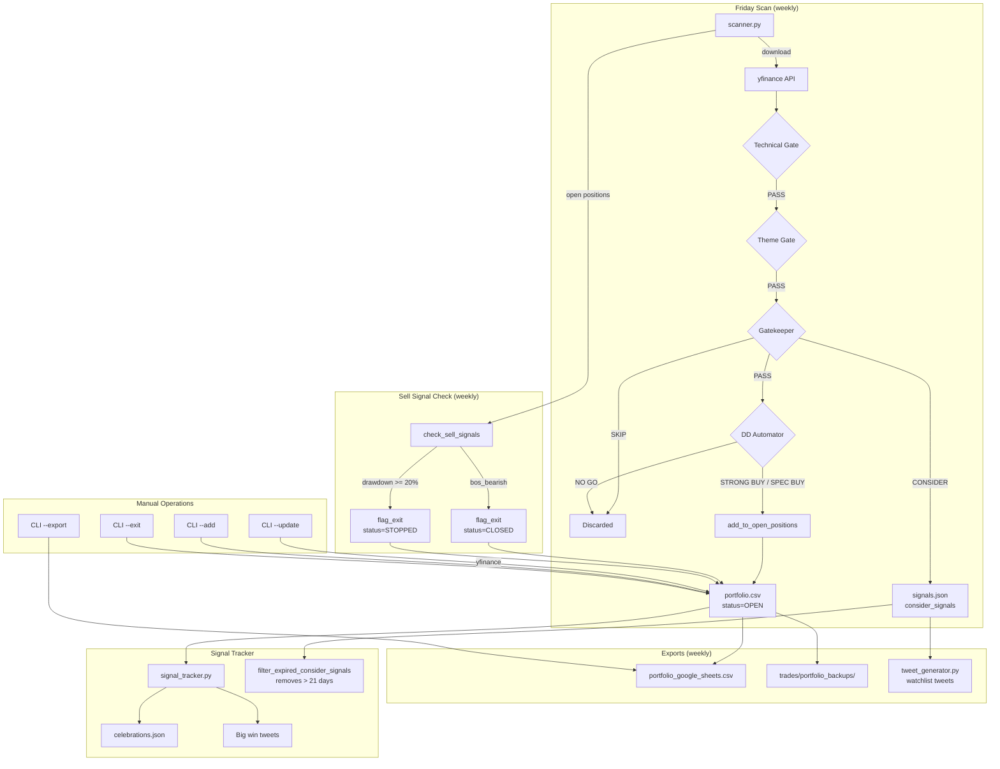

# Portfolio Tracking System Audit

**Document:** `docs/audit/03-portfolio-tracking.md`
**Audit Date:** January 29, 2026
**Source Files Audited:** `portfolio_manager.py`, `scanner.py`, `signal_tracker.py`

---

## Table of Contents

1. [Data Model](#1-data-model)
2. [Position Lifecycle](#2-position-lifecycle)
3. [Watchlist & Signal Tracker System](#3-watchlist--signal-tracker-system)
4. [Price Update Sources](#4-price-update-sources)
5. [Data Integrity Mechanisms](#5-data-integrity-mechanisms)
6. [Data Flow Diagram](#6-data-flow-diagram)
7. [Entity Relationship Diagram](#7-entity-relationship-diagram)
8. [Concerns & Recommendations](#8-concerns--recommendations)

---

## 1. Data Model

### 1.1 Storage Format

The portfolio uses **CSV files** as its primary persistence layer. There is no database.

| File | Purpose | Location |
|------|---------|----------|
| `trades/portfolio.csv` | **Source of truth** - all trades (open + closed) | Line 64 of `portfolio_manager.py` |
| `trades/portfolio_google_sheets.csv` | Export with calculated fields | Line 65 |
| `trades/portfolio_backups/` | Timestamped backup copies | Line 66-67 |
| `trades/signals.json` | Weekly scan results (PASS + CONSIDER + sell signals) | `scanner.py` |
| `trades/celebrations.json` | Big win milestone tracking | `signal_tracker.py` |

**Legacy files (deprecated):**
| File | Purpose | Status |
|------|---------|--------|
| `trades/open_positions.csv` | Old separate open positions file | Replaced by unified `portfolio.csv` |
| `trades/trade_log.csv` | Old signal history | Not auto-imported |

### 1.2 Trade Schema (portfolio.csv)

**11 stored fields** defined at `portfolio_manager.py:248-251`:

```
ticker, status, entry_date, entry_price, exit_date, exit_price,
highest_close, theme, tier, signal_type, conviction, notes
```

| Field | Type | Example | Description |
|-------|------|---------|-------------|
| `ticker` | str | "RCAT" | Stock symbol (uppercase) |
| `status` | str | "OPEN" | OPEN, CLOSED, or STOPPED |
| `entry_date` | str | "2026-01-09" | Date position opened |
| `entry_price` | float | 8.50 | Price at entry |
| `exit_date` | str | "2026-01-20" | Date position closed (empty if OPEN) |
| `exit_price` | float | 13.25 | Price at exit (empty if OPEN) |
| `highest_close` | float | 13.25 | Highest close since entry (for trailing stop) |
| `theme` | str | "Drone Technology" | Thematic classification at entry |
| `tier` | str | "TIER1" | Banker-based tier at entry (TIER1/2/3) |
| `signal_type` | str | "PASS" | Gatekeeper decision (PASS only; CONSIDER not tracked) |
| `conviction` | int | 4 | Gatekeeper conviction score (1-5) |
| `notes` | str | "Exit: Trailing stop" | Free-text notes, appended on exit |

### 1.3 Trade Dataclass

**Definition:** `portfolio_manager.py:136-238`

**Stored fields** (lines 139-150):
```python
@dataclass
class Trade:
    ticker: str
    status: str = "OPEN"
    entry_date: str = ""
    entry_price: float = 0.0
    exit_date: str = ""
    exit_price: float = 0.0
    highest_close: float = 0.0
    theme: str = ""
    tier: str = ""
    signal_type: str = "PASS"
    conviction: int = 0
    notes: str = ""
```

**Calculated fields** (in-memory only, lines 153-159):
```python
    current_price: float = 0.0
    pnl_pct: float = 0.0
    pnl_usd: float = 0.0
    stop_level: float = 0.0
    days_held: int = 0
    distance_to_stop_pct: float = 0.0
    stop_alert: bool = False
```

### 1.4 TradeStatus Enum

**Definition:** `portfolio_manager.py:126-130`

| Status | Meaning | How Set |
|--------|---------|---------|
| `OPEN` | Active position | On creation (`add_trade`) |
| `CLOSED` | Manual/strategic exit | `flag_exit()` when reason lacks "stop" |
| `STOPPED` | Trailing stop hit | `flag_exit()` when reason contains "stop"/"trailing" |

### 1.5 Metadata Captured at Entry

When a position is added via `add_trade_from_stock()` (`portfolio_manager.py:321-331`):

| Metadata | Source | Notes |
|----------|--------|-------|
| ticker | `stock.symbol` | Uppercased |
| entry_price | `stock.price` | Current price at scan time |
| entry_date | `datetime.now()` | Date the scan ran |
| highest_close | `entry_price` | Initialized to entry price |
| theme | `stock.theme` | From thematic analyzer |
| tier | `stock.tier` | TIER1/2/3 from banker score |
| signal_type | `stock.final_decision` | "PASS" (only PASS signals enter portfolio) |
| conviction | `stock.conviction` | Gatekeeper conviction 1-5 |

---

## 2. Position Lifecycle

### 2.1 How New Positions Are Added

**Entry path:** Scanner → DD automator → Portfolio

```
scanner.py main pipeline
  ├─ Technical gate (Beta + BoS + Banker)
  ├─ Thematic gate (LLM)
  ├─ Gatekeeper gate (LLM) → PASS / CONSIDER / SKIP
  ├─ DD automator (LLM) → STRONG BUY / SPEC BUY / NO GO
  │
  └─ Only DD-PASS stocks added to portfolio [scanner.py:3240-3243]
      └─ add_to_open_positions(stock) [scanner.py:1075]
          ├─ If PORTFOLIO_MANAGER_AVAILABLE:
          │   └─ add_trade_to_portfolio(stock) [portfolio_manager.py:885]
          │       └─ pm.add_trade_from_stock(stock) [line 321]
          │           └─ pm.add_trade(...) [line 292]
          │               ├─ Check for duplicate (existing OPEN position)
          │               ├─ Create Trade object
          │               ├─ Append to self.trades
          │               └─ _save() → writes CSV + creates backup
          │
          └─ Else (legacy):
              └─ Append row to open_positions.csv [line 1089-1112]
```

**Duplicate prevention:** `add_trade()` at line 298-301 checks `get_open_position(ticker)` before adding. Returns existing trade if already open.

**Manual addition via CLI:**
```bash
python portfolio_manager.py --add TICKER --price 10.50 --theme "AI"
```

### 2.2 How Position Data Is Updated

**Price refreshes occur via two paths:**

**Path 1: During weekly scan** (`scanner.py`)
- `_check_sell_signals_portfolio_manager()` updates `highest_close` (line 952-953)
- `export_for_google_sheets()` calls `update_prices()` which refreshes all open positions (line 634)

**Path 2: Manual CLI** (`portfolio_manager.py`)
```bash
python portfolio_manager.py --update
```
- Calls `update_prices()` (line 378)
- Downloads prices via yfinance for all open positions
- Updates `highest_close`, `current_price`, all calculated metrics
- Saves to CSV

**Calculated metrics** updated in `Trade.calculate_metrics()` (line 168-203):
- `pnl_pct` = `(current_price - entry_price) / entry_price * 100`
- `stop_level` = `highest_close * 0.80`
- `distance_to_stop_pct` = `(current_price - stop_level) / current_price * 100`
- `stop_alert` = `distance_to_stop_pct <= 5.0`
- `days_held` = `(today - entry_date).days`

### 2.3 How Positions Are Closed

**Two automated exit triggers in `_check_sell_signals_portfolio_manager()` (scanner.py:931-993):**

| Trigger | Condition | Status Set | Code |
|---------|-----------|-----------|------|
| Weekly BoS Down | `stock.bos_bearish == True` | CLOSED | Line 965 |
| Trailing Stop | `drawdown_pct >= 20.0` | STOPPED | Line 969 |

Both call `pm.flag_exit(symbol, current_price, reason=sell_reason)` at line 982.

**`flag_exit()` logic** (`portfolio_manager.py:333-352`):
1. Find open position by ticker
2. Set status: "STOPPED" if reason contains "stop"/"trailing", else "CLOSED"
3. Set `exit_date` to current date
4. Set `exit_price` to provided price
5. Append reason to `notes`
6. Call `calculate_metrics()` and `_save()`

**Manual exit via CLI:**
```bash
python portfolio_manager.py --exit TICKER --exit-price 15.00
```

### 2.4 Where Closed Positions Are Archived

Closed positions remain **in the same `portfolio.csv` file** with status changed to CLOSED or STOPPED. There is no separate archive file. All historical trades are preserved in the single CSV.

Retrieval methods:
- `pm.get_closed_trades()` → filters `self.trades` by status != "OPEN" (line 366-368)
- `pm.get_open_positions()` → filters by status == "OPEN" (line 362-364)
- Google Sheets export includes all trades (open + closed)

**Backup copies** in `trades/portfolio_backups/` provide point-in-time snapshots but are not used for archival queries.

---

## 3. Watchlist & Signal Tracker System

### 3.1 Active Portfolio vs Watchlist

| Category | Storage | Entry Criteria | Tracked In |
|----------|---------|---------------|------------|
| **Active Portfolio** | `portfolio.csv` | DD-PASS (STRONG BUY / SPEC BUY) | `portfolio_manager.py` |
| **Bullish Watchlist** | `signals.json` → `consider_signals` | Gatekeeper CONSIDER (passed 4/5 gates) | `scanner.py`, `tweet_generator.py` |
| **Caution Alerts** | `signals.json` → `sell_signals` | Open positions with BoS Down or near stop | `scanner.py` |

**CONSIDER signals are NOT added to portfolio.csv.** They exist only in `signals.json` and are used for tweet content generation (watchlist-style posts).

### 3.2 How Tickers Move Between States

```
Universe (~1,800 tickers)
  │
  ├─ Technical Gate → ~44 pass
  ├─ Theme Gate → ~17 pass
  ├─ Gatekeeper →
  │   ├─ PASS (6) → DD Automator →
  │   │   ├─ STRONG BUY / SPEC BUY → portfolio.csv (OPEN)
  │   │   └─ NO GO → Not added
  │   ├─ CONSIDER (7) → signals.json consider_signals (watchlist)
  │   └─ SKIP → Discarded
  │
  ├─ Open positions monitored weekly:
  │   ├─ BoS Down → CLOSED (in portfolio.csv)
  │   ├─ 20% drawdown → STOPPED (in portfolio.csv)
  │   └─ Neither → Remains OPEN
  │
  └─ CONSIDER signals expire after 21 days (signal_tracker.py:939-981)
```

### 3.3 Signal Tracker Module (`signal_tracker.py`)

**Purpose:** Tracks historical performance, big wins, and watchlist freshness.

**Key dataclasses:**
- `HistoricalSignal` (lines 40-54): ticker, entry_date, entry_price, current_price, pnl_pct, theme, conviction, days_held, status
- `BigWin` (lines 57-70): threshold_crossed (25%, 50%, 100%), celebration_type ("big_win", "home_run", "hall_of_fame")

**Key functions:**

| Function | Lines | Purpose |
|----------|-------|---------|
| `load_historical_signals()` | 210-265 | Load all trades with current P&L |
| `find_big_wins()` | 274-310 | Find signals crossing celebration thresholds |
| `get_uncelebrated_wins()` | 362-397 | Get wins needing celebration posts |
| `filter_expired_consider_signals()` | 939-981 | Remove CONSIDER signals > 21 days old |
| `get_winners_for_showcase()` | 751-812 | Get winners for tweet content (25%+ P&L) |
| `get_recent_closes()` | 815-872 | Get recently closed positions |
| `get_early_movers()` | 875-936 | Get new signals showing early strength |

### 3.4 Celebrations Tracking

**File:** `trades/celebrations.json`

**Schema:**
```json
{
  "RCAT": {
    "25_pct": "2026-01-15",
    "50_pct": null,
    "100_pct": null
  }
}
```

**Thresholds:**
| Threshold | Celebration Type | Label |
|-----------|-----------------|-------|
| 25% | "big_win" | Standard milestone |
| 50% | "home_run" | Home run |
| 100% | "hall_of_fame" | Hall of fame |

**Prevents duplicate celebration posts** via `is_celebrated()` and `mark_as_celebrated()` functions.

### 3.5 CONSIDER/CAUTION Naming Confusion

There is a naming inconsistency across the codebase:

| Module | Term | Meaning |
|--------|------|---------|
| `gatekeeper.py` | `CAUTION` | Gatekeeper decision (watchlist) |
| `scanner.py` | `CONSIDER` | Same signal, renamed for internal use |
| `tweet_generator.py` | `consider_signals` | Bullish watchlist (passed gates 1-4) |
| `tweet_generator.py` | `caution_signals` | Open position warnings (legacy name, often empty) |

At `tweet_generator.py:2039-2042`, the mapping is explicit:
```python
content.consider_signals = data.caution_signals  # Bullish watchlist
content.caution_signals = []  # Reserved for open position warnings
```

### 3.6 Retention Policy

| Signal Type | Retention | Mechanism |
|-------------|-----------|-----------|
| PASS → Portfolio trades | Permanent (in portfolio.csv) | Never deleted |
| CONSIDER (watchlist) | 21 days | `filter_expired_consider_signals()` removes stale entries |
| Celebrations | Permanent (in celebrations.json) | Never deleted |
| signals.json | Overwritten weekly | Each Friday scan replaces the file |

---

## 4. Price Update Sources

### 4.1 yfinance (Primary)

**Used in:**
- `portfolio_manager.py:update_prices()` (line 378-446) - bulk download via `yf.download()`
- `portfolio_manager.py:is_ticker_valid()` (line 82-106) - delisted ticker check via `yf.Ticker().info`
- `scanner.py:download_and_process()` (line 524) - main scan data download

**Refresh frequency:**
| Context | When | Trigger |
|---------|------|---------|
| Weekly scan | Friday ~4:30 PM ET | GitHub Actions cron |
| Manual update | On demand | `python portfolio_manager.py --update` |
| Google Sheets export | During scan completion | `pm.export_for_google_sheets()` |

**Error handling in `update_prices()`** (lines 417-441):
```python
try:
    data = yf.download(symbols, period='5d', progress=False)
    # Handle MultiIndex for multiple tickers
    # Handle single ticker case separately
    # Extract latest close price
except Exception:
    # Silently continue - position keeps old price
```

- Failed downloads do not raise exceptions
- Positions with failed price fetches retain their previous `current_price`
- No retry logic for individual ticker failures
- Delisted ticker check is optional (`check_delisted=False` by default)

### 4.2 Scanner Data (Secondary)

When `update_prices()` receives `stocks_dict` parameter (from scanner), it uses scanner-provided prices instead of yfinance:

```python
# portfolio_manager.py:408-415
if stocks_dict:
    for trade in open_trades:
        if trade.ticker in stocks_dict:
            stock = stocks_dict[trade.ticker]
            trade.calculate_metrics(stock.price)
```

### 4.3 Google Sheets GOOGLEFINANCE (External)

The Google Sheets export template includes a formula for live prices:
```
=IF(B2="OPEN", GOOGLEFINANCE(A2, "price"), G2)
```

This runs independently in Google Sheets and is not read back into the system.

---

## 5. Data Integrity Mechanisms

### 5.1 Duplicate Prevention

**In `add_trade()`** (`portfolio_manager.py:298-301`):
```python
existing = self.get_open_position(ticker)
if existing:
    print(f"  ⚠ {ticker} already has an open position")
    return existing
```

- Checks for existing OPEN position with same ticker
- Returns existing trade instead of creating duplicate
- Does NOT prevent adding a new OPEN position for a ticker that has a CLOSED position (re-entry allowed)

**In migration** (`portfolio_manager.py:776-786`):
- Uses `seen_tickers` set to prevent duplicate imports

### 5.2 Orphaned Record Handling

**No explicit orphaned record detection.** Potential orphan scenarios:

| Scenario | What Happens | Risk |
|----------|-------------|------|
| Ticker delisted while OPEN | Position stays OPEN forever | `is_ticker_valid()` exists but not auto-run |
| Scanner can't find ticker data | `if symbol not in stocks: continue` — position skipped in sell check | Stop not evaluated |
| Portfolio manager import fails | Falls back to legacy CSV silently | Dual-write risk |

### 5.3 Backup/Recovery Procedures

**Automatic backups** on every `_save()` call (`portfolio_manager.py:275-279`):
```python
if self.portfolio_file.exists():
    backup_file = BACKUP_DIR / f"portfolio_{datetime.now().strftime('%Y%m%d_%H%M%S')}.csv"
    shutil.copy(self.portfolio_file, backup_file)
```

- **Frequency:** Every save operation (add, exit, price update, export)
- **Location:** `trades/portfolio_backups/`
- **Naming:** `portfolio_YYYYMMDD_HHMMSS.csv`
- **Retention:** No automatic cleanup — backups accumulate indefinitely
- **Recovery:** Manual copy: `cp trades/portfolio_backups/portfolio_XXXX.csv trades/portfolio.csv`

### 5.4 Type Safety

`Trade.from_csv_row()` (line 222-238) uses defensive defaults:
```python
entry_price=float(row.get('entry_price') or 0)
conviction=int(row.get('conviction') or 0)
```

All numeric conversions fall back to 0 on empty/missing values. No validation of business rules (e.g., negative prices).

### 5.5 Concurrent Access

**No locking mechanism.** The GitHub Actions workflows include a `git pull --rebase` before push (`daily_post.yml:195-199`) to handle race conditions, but the CSV itself has no file-level locking.

---

## 6. Data Flow Diagram



---

## 7. Entity Relationship Diagram

```mermaid
erDiagram
    PORTFOLIO_CSV {
        string ticker PK
        string status "OPEN|CLOSED|STOPPED"
        string entry_date
        float entry_price
        string exit_date
        float exit_price
        float highest_close
        string theme
        string tier "TIER1|TIER2|TIER3"
        string signal_type "PASS"
        int conviction "1-5"
        string notes
    }

    SIGNALS_JSON {
        string timestamp
        string timeframe "WEEKLY"
        json stats
        json pass_signals "PASS decisions"
        json consider_signals "CONSIDER decisions (watchlist)"
        json sell_signals "Exit alerts"
        json themes "Theme classifications"
    }

    CELEBRATIONS_JSON {
        string ticker PK
        string 25_pct "date or null"
        string 50_pct "date or null"
        string 100_pct "date or null"
    }

    GOOGLE_SHEETS_CSV {
        string ticker FK
        string status
        float current_price "calculated"
        float stop_level "calculated"
        float pnl_pct "calculated"
        float distance_to_stop "calculated"
        string stop_alert "emoji"
    }

    BACKUP_CSV {
        string filename "portfolio_YYYYMMDD_HHMMSS.csv"
        string contents "full snapshot"
    }

    PORTFOLIO_CSV ||--o{ GOOGLE_SHEETS_CSV : "exported to"
    PORTFOLIO_CSV ||--o{ BACKUP_CSV : "backed up as"
    PORTFOLIO_CSV ||--o{ CELEBRATIONS_JSON : "tracked in"
    SIGNALS_JSON ||--o{ PORTFOLIO_CSV : "PASS signals become trades"
    SIGNALS_JSON ||--|| SIGNALS_JSON : "CONSIDER stays as watchlist"
```

**Relationships:**
- A PASS signal in `signals.json` that passes DD becomes a row in `portfolio.csv`
- A CONSIDER signal in `signals.json` stays as watchlist only (never enters `portfolio.csv`)
- Each `portfolio.csv` trade may have celebration milestones in `celebrations.json`
- Every save operation creates a new `backup_csv` snapshot
- `portfolio_google_sheets.csv` is a derived export with calculated columns

---

## 8. Concerns & Recommendations

### C1: No Backup Cleanup (LOW)

Backups are created on every `_save()` call with no rotation or cleanup. Over time, the `portfolio_backups/` directory will grow indefinitely.

**Recommendation:** Add a retention policy (e.g., keep last 30 days or last 100 backups).

### C2: No File Locking (MEDIUM)

The CSV has no concurrent access protection. If `daily_post.yml` and a manual `--update` run simultaneously, data corruption is possible.

**Recommendation:** Use `fcntl.flock()` or an atomic write pattern (write to temp file, then rename).

### C3: Delisted Tickers Not Auto-Detected (MEDIUM)

`is_ticker_valid()` exists but `check_delisted=False` by default in `update_prices()`. A delisted ticker stays OPEN indefinitely with a stale price.

**Recommendation:** Enable `check_delisted=True` periodically (e.g., monthly) or flag positions with no price update for 5+ days.

### C4: CONSIDER Signals Not Tracked Longitudinally (LOW)

CONSIDER (watchlist) signals exist only in `signals.json`, which is overwritten weekly. There is no historical record of which tickers were on the watchlist in previous weeks.

**Recommendation:** Archive `signals.json` weekly (already partially done via `trades/weeks/` directory).

### C5: Legacy Fallback Path Still Active (LOW)

If `portfolio_manager.py` fails to import, the system silently falls back to `open_positions.csv` (lines 66-80 of `scanner.py`). The legacy path has no `flag_exit()` — it simply removes rows from the CSV, losing exit metadata.

**Recommendation:** Either remove the legacy path or add a loud warning when it activates.

### C6: No Validation of Business Rules on CSV Load (LOW)

`Trade.from_csv_row()` converts types defensively but doesn't validate:
- Negative prices
- Exit date before entry date
- STOPPED status without exit_price
- highest_close < entry_price

**Recommendation:** Add a `validate()` method called after loading.

### C7: highest_close Updated in 3 Places (INFO)

As documented in audit 02, `highest_close` is updated in:
1. `scanner.py:952` (sell signal check)
2. `portfolio_manager.py:174` (calculate_metrics)
3. `portfolio_manager.py:464` (check_stop_signals)

All three are consistent logic (`if current > highest, update`), but the redundancy could drift.

### C8: CONSIDER vs CAUTION Naming Confusion (LOW)

The naming is inconsistent across modules (see Section 3.5). This creates confusion when reading code across files.

**Recommendation:** Standardize on one term (preferably "WATCHLIST") across all modules.

---

## Appendix: Key Line References

| Item | File | Line(s) |
|------|------|---------|
| Trade dataclass | portfolio_manager.py | 136-238 |
| TradeStatus enum | portfolio_manager.py | 126-130 |
| CSV fieldnames | portfolio_manager.py | 248-251 |
| PortfolioManager class | portfolio_manager.py | 245-873 |
| add_trade() | portfolio_manager.py | 292-319 |
| add_trade_from_stock() | portfolio_manager.py | 321-331 |
| flag_exit() | portfolio_manager.py | 333-352 |
| update_prices() | portfolio_manager.py | 378-446 |
| check_stop_signals() | portfolio_manager.py | 448-484 |
| export_for_google_sheets() | portfolio_manager.py | 624-672 |
| migrate_from_old_format() | portfolio_manager.py | 772-825 |
| _save() with backup | portfolio_manager.py | 273-286 |
| is_ticker_valid() | portfolio_manager.py | 82-106 |
| PORTFOLIO_MANAGER_AVAILABLE | scanner.py | 66-80 |
| add_to_open_positions() | scanner.py | 1075-1112 |
| load_open_positions() | scanner.py | 1115-1139 |
| check_sell_signals() | scanner.py | 913-928 |
| DD-PASS → portfolio add | scanner.py | 3240-3243 |
| Portfolio summary/export | scanner.py | 3294-3327 |
| signal_tracker.py | signal_tracker.py | 1-1136 |
| filter_expired_consider_signals() | signal_tracker.py | 939-981 |
| celebrations.json schema | signal_tracker.py | 317-397 |

---

*End of Portfolio Tracking Audit*
